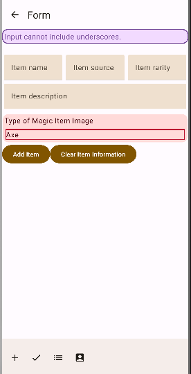
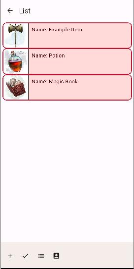
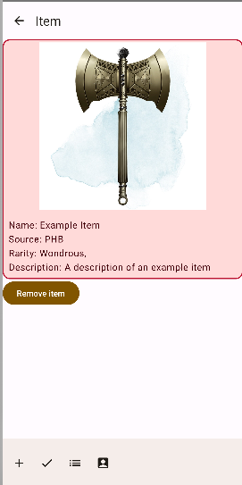
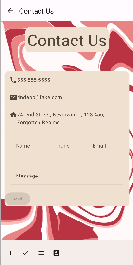

# Assignment3_AppDev

This was a school assignment to make a multi-screen application in Kotlin Compose in Android Studio.
The app is to be used to create entries for magic items from Dungeons & Dragons and view them. 

## Screens
### Create Item
The user must input a name, source (PHB, homebrew, etc.) rarity, description and selected image to create a magic item.

### Item List View
Displays a list to the user of simplified versions of the magic items that can be clicked on to see more detail.

### Show Item
After creation or when navigated to by clicking on it from the list view, the user can see a detailed view of the item they made.

### Contact
A non-functional sample contact page.

